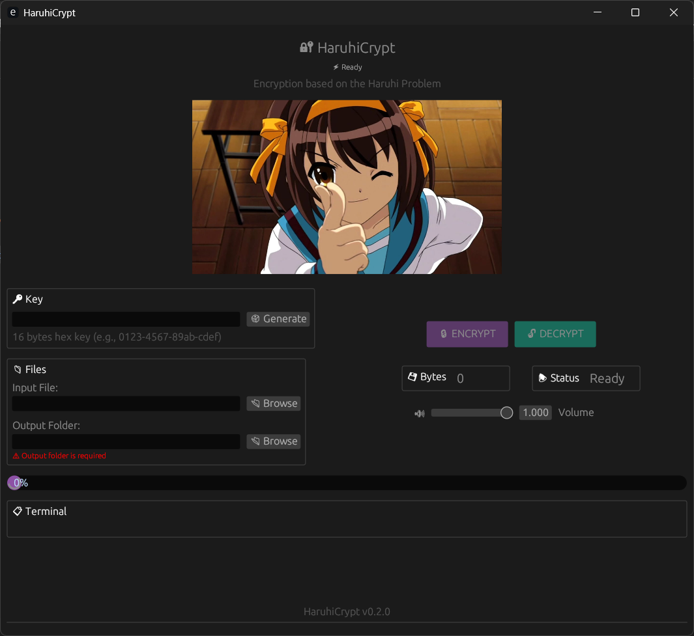

# HaruhiCrypt

**Encryption based on the Haruhi Problem (Superpermutations)**


*Because permutations are also cute, and even more so when Haruhi arranges them.*

---

## The Haruhi Problem

The **Haruhi Problem** is a mathematical problem inspired by the anime series *The Melancholy of Haruhi Suzumiya*, which aired in a non-linear order (14 episodes broadcast across different arcs).

### The Question

> If you wanted to watch the 14 episodes of the first season in **every possible order**, what is the shortest string of episodes you would need to watch?

Formally: **What is the shortest string containing all permutations of n symbols?**

### Known Solutions

| n | Permutations | Minimum Length |
|---|--------------|----------------|
| 2 | 2! = 2 | 3 (`121`) |
| 3 | 6 | 9 (`123121321`) |
| 4 | 24 | 33 |
| 5 | 120 | 153 |
| 8 | 40,320 | ~46,233 (lower bound) |

For n > 5, finding the minimal superpermutation is an **open problem** in mathematics.

### Mathematical Context

A **superpermutation** is a string that contains every permutation of n symbols as a substring. For example, for n=2, `121` contains:
- `12` (positions 1-2)
- `21` (positions 2-3)

The lower bound was proven in 2011 by an anonymous poster on 4chan:
```
length >= n! + (n-1)! + (n-2)! + n - 3
```

In October 2018, Robin Houston, Jay Pantone, and Vince Vatter refined the proof, bringing worldwide attention to the problem.

---

## How HaruhiCrypt Uses This Problem

### Algorithm

1. **Key Derivation**: The key is processed through Argon2id to produce a 256-bit seed.

2. **Superpermutation**: A superpermutation containing all 40,320 permutations (n=8, 317,521 bytes) is generated once and cached in memory using `OnceLock`.

3. **CTR Mode Encryption**: Each 8-byte block is encrypted using:
   ```
   keystream_block = SHA256(seed || nonce || block_index)
   result = plaintext XOR keystream_block
   ```
   The keystream is derived from the seed and nonce, ensuring unique encryption per file.

### Why This Is Unique

HaruhiCrypt is the only cipher that bases its security on the **Haruhi Problem** - a mathematical open problem. Unlike traditional ciphers:

- **Unique Foundation**: Based on superpermutations (np-hard problem for n > 5)
- **No Fixed Structures**: Unlike AES or DES, no predetermined S-boxes or tables
- **Visual Metaphor**: The cipher literally "arranges episodes" of data in every possible order

### Security

Security is based on two computationally hard problems:

1. **Superpermutations**: Constructing minimal superpermutations is difficult for n > 5 (open problem). Our implementation uses a near-minimal superpermutation.

2. **Irreversibility**: Without knowing the key (seed), determining which permutations were used and in what order is computationally infeasible.

### File Format

```
[16 bytes: nonce][16 bytes: salt][1 byte: ext_len][N bytes: extension][encrypted data][32 bytes: HMAC-SHA256]
```

- **nonce**: Unique 16-byte value per file (anti-replay)
- **salt**: Unique 16-byte random salt per file (key derivation)
- **ext_len**: Length of original file extension
- **extension**: Original file extension
- **encrypted data**: Ciphertext in CTR mode
- **HMAC**: Authenticates salt + nonce + ext_len + extension + ciphertext

---

## Usage

### GUI Interface

The UI is inspired by MikuMikuBeam's design with a purple/teal theme and animated elements.

1. Run `haruhi-crypt.exe`
2. Enter a key or generate a random one (🎲 Generate)
3. Select an input file (📂 Browse)
4. Select an output folder (required)
5. Press **🔒 ENCRYPT** or **🔓 DECRYPT**
6. Monitor progress via the stats cards and terminal

### UI Features

- **Dual Image System**: Haruhi image changes during encryption (haruhi.jpg → haruhi-1.jpg)
- **Pulse Effect**: Purple pulse overlay during active processing
- **Stats Cards**: Real-time Bytes and Status display
- **Adaptive Terminal**: Auto-adjusting log display
- **Two-Column Layout**: Key/Files section (left), Buttons/Stats section (right)
- **Background Music**: Dual-track loop with real-time volume control
- **Status Icons**: ⚡ Ready, ⚙️ Processing..., ✅ Done!

### Key Example

A key has the format:
```
a1b2c3d4-e5f6g7h8-i9j0k1l2-m3n4o5p6
```

**Save your key** - without it you won't be able to decrypt your files.

---

## Compilation

```bash
# Development
cargo build

# Release (portable exe)
cargo build --release
```

The standalone executable will be at `target/release/haruhi-crypt.exe`.

---

## Architecture

```
┌──────────────────────────── HaruhiCrypt v0.2.0 ─────────────────────────────┐
│                                                                             │
│   Key    ──► Argon2id ──► 256-bit seed                                      │
│                                   │                                         │
│   Nonce ──────────────────────────┘                                         │
│                                   │                                         │
│                                   ▼                                         │
│   ┌──────────────────────── CTR Mode Encryption ─────────────────────────┐  │
│   │ keystream = SHA256(seed || nonce || block_index)                     │  │
│   │ ciphertext = plaintext XOR keystream                                 │  │
│   └──────────────────────────────────────────────────────────────────────┘  │
│                                   │                                         │
│                                   ▼                                         │
│   ┌─────────────────────── HMAC Authentication ──────────────────────────┐  │
│   │ HMAC-SHA256(seed || nonce || ciphertext)                             │  │
│   └──────────────────────────────────────────────────────────────────────┘  │
│                                                                             │
└─────────────────────────────────────────────────────────────────────────────┘
```

### UI Design

Inspired by **MikuMikuBeam**, HaruhiCrypt features a cute and functional interface:

- **Color Scheme**: Purple (#9b59b2) for ENCRYPT, Teal (#1abc9c) for DECRYPT
- **Animation States**: Image transitions and pulse effects during processing
- **Two-Column Layout**: Key/Files on left, Buttons/Stats on right
- **Feedback**: Real-time progress bar, stats cards, and terminal logging
- **Background Music**: Auto-plays on startup with volume slider control



---

## Dependencies

- **egui/eframe**: Portable GUI (OpenGL)
- **sha2**: SHA-256 for keystream generation
- **hmac**: HMAC-SHA256 authentication
- **subtle**: Constant-time cryptography operations
- **rand**: Random nonce/salt generation
- **rfd**: File selection dialog
- **image**: Image loading for UI
- **chrono**: Timestamps for logging
- **rodio**: Background music playback (minimp3 decoder)
- **argon2**: Password hashing (Argon2id key derivation)

---

## Security Improvements (v0.2.0+)

- **Key Derivation**: Argon2id instead of raw SHA-256 (memory-hard, GPU-resistant)
- **Key Separation**: Separate keys for encryption and HMAC (64 bytes derived)
- **Counter Mode**: CTR instead of ECB (no patterns in ciphertext)
- **Authenticated Encryption**: HMAC authenticates salt + nonce + ciphertext
- **Nonce Anti-Replay**: 16-byte unique nonce per file
- **Per-File Salt**: Unique 16-byte random salt per file (not hardcoded)
- **Constant-Time MAC**: Timing-safe comparison to prevent timing attacks
- **Unbiased Keystream**: Uses independent hash bytes for permutation selection and data
- **PKCS#7 Padding**: Always at least 1 block of padding

---

## Changelog

### v0.3.0 (2026-05-25)
- **Security Fix**: Per-file random salt (16 bytes) instead of hardcoded salt
- **Security Fix**: HMAC now includes salt in authentication
- **Security Fix**: Constant-time MAC comparison to prevent timing attacks
- **Security Fix**: Validate all header offsets before slicing to prevent DoS
- **Security Fix**: Fixed keystream bias (uses independent hash bytes for permutation and data)
- **Security Fix**: Separate keys for encryption and HMAC (64 bytes derived from Argon2)
- **Cleanup**: Removed unused IV field from file format
- **Breaking Change**: New file format (no IV, includes salt)

### v0.2.0 (2026-05-25)
- **Security**: Replaced ECB with CTR mode
- **Key Derivation**: SHA-256 → Argon2id
- **Authentication**: HMAC now authenticates nonce + IV + ciphertext
- **Anti-Replay**: 16-byte nonce per encryption
- **Padding**: PKCS#7 standard (always at least 1 block)
- **Performance**: Superpermutation cached with OnceLock

### v0.1.0
- Initial release with ECB-mode permutation cipher

---

## Limitations

- **8-byte blocks**: Encryption works with 8-byte blocks
- **Not verified cryptography**: This is an educational/experimental project. For real use, use AES-GCM or similar.
- **Superpermutation**: Cached in memory after first generation (OnceLock) - not regenerated on each use

---

## References

- [Superpermutation - Wikipedia](https://en.wikipedia.org/wiki/Superpermutation)
- [The Minimal Superpermutation Problem - Nathaniel Johnston](http://www.njohnston.ca/2013/04/the-minimal-superpermutation-problem/)
- [Quanta Magazine: Sci-Fi Writer Greg Egan and Anonymous Math Whiz Advance Permutation Problem](https://www.quantamagazine.org/sci-fi-writer-greg-egan-and-anonymous-math-whiz-advance-permutation-problem-20181105/)
- [4chan Post (2011) - Original Lower Bound Proof](https://www.seanbers.com/4chan-proof/)

---

*HaruhiCrypt - Because anime math can protect your files.*
